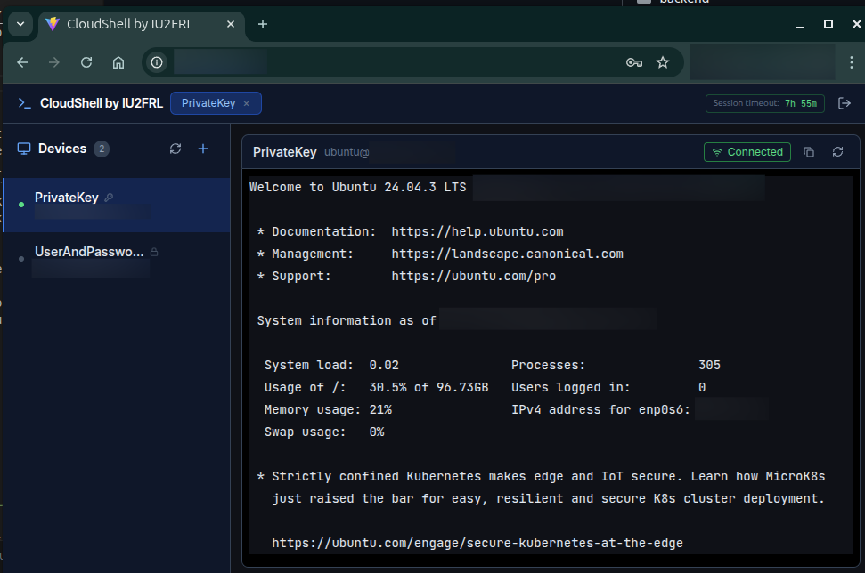

# CloudShell

> A self-hosted, Docker-deployable web SSH gateway: open your SSH sessions right in the browser, no client software required.

[](https://github.com/iu2frl/CloudShell/blob/main/LICENSE)
[](https://www.python.org/)
[](https://nodejs.org/)
[](https://react.dev/)
[](https://docs.docker.com/compose/)

## Motivation

I really liked the idea behind some existing tools like [ShellNGN](https://shellngn.com/), but I did not like having to pay to self host something, so CloudShell was built to be free and open.

- Is it better than ShellNGN? Hell no!
- Does it work? Yes!
- Is it free? Absolutely!

## Screenshots

Terminal screen:



## Features

- [x] **Web terminal**: full xterm.js terminal emulator with ANSI/VT100 support, copy/paste, and proper resize (SIGWINCH propagation)
- [x] **Multi-tab sessions**: open multiple SSH connections to different devices simultaneously
- [x] **Device manager**: add, edit, and delete SSH targets with name, host, port, and credentials
- [x] **Password & SSH key auth**: store passwords or PEM private keys, both encrypted at rest (AES-256-GCM)
- [x] **Built-in key generator**: generate RSA-4096 key pairs directly from the UI; copy the public key to paste into `authorized_keys`
- [x] **Key file upload**: load an existing private key from a local `.pem` / `id_rsa` file instead of copy-pasting
- [x] **JWT session auth**: login page, configurable session TTL, silent token refresh, and token revocation on logout
- [x] **Change password**: update the admin password at runtime without restarting
- [x] **Session expiry badge**: live countdown in the header turns yellow/red as the session approaches expiry
- [x] **Toast notifications**: non-blocking feedback for every action
- [x] **Error boundary**: graceful recovery screen for unexpected frontend errors
- [x] **Docker Compose deploy**: single command to run in production
- [ ] **SFTP**: secure file transfer over SSH
- [ ] **File manager**: browse and manage files on the remote server
- [ ] **Multi-user support**: allow multiple users to access the same CloudShell instance
- [ ] **Audit logging**: track user actions and changes for compliance and troubleshooting
- [ ] **VNC**: access remote desktops over VNC

## Quick Start

### Using prebuilt images

```yaml
services:

  # ── Backend: FastAPI + AsyncSSH ─────────────────────────────────────────────
  backend:
    image: ghcr.io/iu2frl/cloudshell-backend:latest
    restart: unless-stopped
    expose:
      - "8000"
    volumes:
      - cloudshell_data:/data
    environment:
      SECRET_KEY: "changeme-asap" # generate with 'openssl rand -hex 32'
      ADMIN_USER: "admin"
      ADMIN_PASSWORD: "changeme"
      TOKEN_TTL_HOURS: "8"
    healthcheck:
      test: ["CMD", "curl", "-sf", "http://localhost:8000/api/health"]
      interval: 30s
      timeout: 5s
      start_period: 15s
      retries: 3
    networks:
      - internal

  # ── Frontend: Nginx + React bundle + reverse proxy ──────────────────────────
  frontend:
    image: ghcr.io/iu2frl/cloudshell-frontend:latest
    restart: unless-stopped
    ports:
      - "8080:80"
    depends_on:
      backend:
        condition: service_healthy
    healthcheck:
      test: ["CMD", "wget", "-qO", "/dev/null", "http://127.0.0.1/"]
      interval: 5s
      timeout: 3s
      start_period: 5s
      retries: 5
    networks:
      - internal

volumes:
  cloudshell_data:

networks:
  internal:
    driver: bridge
```

### Build locally

```bash
git clone https://github.com/iu2frl/CloudShell
cd CloudShell
cp .env.example .env
# Edit .env - set a strong SECRET_KEY and ADMIN_PASSWORD
docker compose up -d
```

Open **<http://localhost:8080>** and log in with your configured credentials.

> [!IMPORTANT]
> Put CloudShell behind a reverse proxy (Nginx, Caddy, Traefik) with TLS. SSH credentials are encrypted at rest but web traffic should be HTTPS.

Prebuilt images are available on GHCR - see **[docs/configuration.md](docs/configuration.md)** for a ready-to-use `docker-compose.yml` snippet and all environment variable options.

## Documentation

| Document | Description |
| --- | --- |
| [docs/user-guide.md](docs/user-guide.md) | How to manage devices, connect terminals, use SSH keys |
| [docs/configuration.md](docs/configuration.md) | Environment variables, secret key generation, security notes |
| [docs/development.md](docs/development.md) | Local dev setup, building, testing, Makefile reference |
| [docs/architecture.md](docs/architecture.md) | System design, data flow, project structure |

## Vibecoded?

✨ AF ✨

## License

GNU General Public License v3.0 - see [LICENSE](LICENSE) for the full text.
