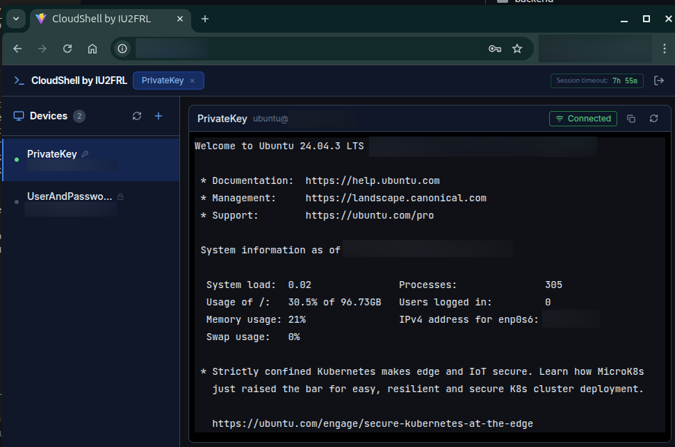
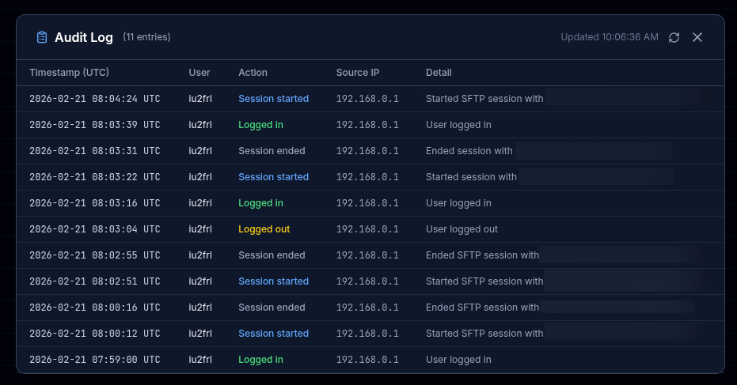

# CloudShell

> A self-hosted, Docker-deployable web SSH, SFTP and FTP(S) gateway: open your remote sessions right in the browser, no client software required.

[](https://github.com/iu2frl/CloudShell/blob/main/LICENSE)
[](https://www.python.org/)
[](https://nodejs.org/)
[](https://react.dev/)
[](https://docs.docker.com/compose/)

## Motivation

I really liked the idea behind some existing tools like [ShellHub](https://github.com/shellhub-io/shellhub), but I did not like having to install anything on the target machine, so CloudShell was built to be quick and simple.

- Is it better than ShellHub? Maybe not.
- Does it work? Yes!
- Is it free? Absolutely!

## Screenshots

Supports SSH, SFTP and FTP(S) connections with (optional) split view:



Supports connections audit:



## Features

- **Web terminal**: full xterm.js terminal emulator with ANSI/VT100 support, copy/paste, and proper resize (SIGWINCH propagation)
- **Multi-tab sessions**: open multiple SSH connections to different devices simultaneously
- **Device manager**: add, edit, and delete SSH targets with name, host, port, and credentials
- **Password & SSH key auth**: store passwords or PEM private keys, both encrypted at rest (AES-256-GCM)
- **Built-in key generator**: generate RSA-4096 key pairs directly from the UI; copy the public key to paste into `authorized_keys`
- **Key file upload**: load an existing private key from a local `.pem` / `id_rsa` file instead of copy-pasting
- **JWT session auth**: login page, configurable session TTL, silent token refresh, and token revocation on logout
- **OIDC sign-in (Pocket ID ready)**: optional OpenID Connect login flow using authorization-code callback, while keeping local login available, with optional group-based allow gate (`OIDC_ALLOWED_GROUP`)
- **Two-factor authentication (2FA)**: optional TOTP-based sign-in protection with backup codes for account recovery, plus optional trusted-device remember mode for 30 days
- **Change password**: update the admin password at runtime without restarting
- **Audit log**: tamper-evident activity log (login, logout, SSH session start/stop, password changes) with configurable retention policy and a dedicated viewer in the UI
- **Session expiry badge**: live countdown in the header turns yellow/red as the session approaches expiry
- **Toast notifications**: non-blocking feedback for every action
- **Error boundary**: graceful recovery screen for unexpected frontend errors
- **Docker Compose deploy**: single command to run in production
- **Concurrent connections**: support multiple simultaneous SSH sessions
- **SFTP file manager**: browse, upload, download, rename, and delete files on any device directly from the browser.
- **FTP/FTPS file manager**: same convenient web-based file operations over plain FTP or explicit FTPS (AUTH TLS).
- **Recursive FTP delete**: securely remove entire directories and their contents in one action, with confirmation prompts to prevent accidents.
- **Configuration import/export**: easily import and export device configurations in standard JSON format.
- **Quick commands**: define up to 8 per-terminal one-click buttons that instantly send a preset command to the active SSH session, persisted across page reloads.

Please note: all sessions are initiated on the server side and not the client.

## Quick Start

### Using prebuilt images

```yaml
services:

  # -- Backend: FastAPI + AsyncSSH ---------------------------------------------
  backend:
    image: ghcr.io/iu2frl/cloudshell-backend:latest
    restart: unless-stopped
    expose:
      - "8000"
    volumes:
      - cloudshell_data:/data
    environment:
      SECRET_KEY: "changeme-asap" # generate with 'openssl rand -hex 32'
      ADMIN_USER: "admin"
      ADMIN_PASSWORD: "changeme"
      TOKEN_TTL_HOURS: "8"
      ENVIRONMENT: "CloudShell on IU2FRL server" # Used to distinguish TOTP tokens
    healthcheck:
      test: ["CMD", "curl", "-sf", "http://localhost:8000/api/health"]
      interval: 30s
      timeout: 5s
      start_period: 15s
      retries: 3
    networks:
      - internal

  # -- Frontend: Nginx + React bundle + reverse proxy --------------------------
  frontend:
    image: ghcr.io/iu2frl/cloudshell-frontend:latest
    restart: unless-stopped
    ports:
      - "8080:80"
    depends_on:
      backend:
        condition: service_healthy
    healthcheck:
      test: ["CMD", "wget", "-qO", "/dev/null", "http://127.0.0.1/"]
      interval: 5s
      timeout: 3s
      start_period: 5s
      retries: 5
    networks:
      - internal

volumes:
  cloudshell_data:

networks:
  internal:
    driver: bridge
```

### Build locally

```bash
git clone https://github.com/iu2frl/CloudShell
cd CloudShell
cp .env.example .env
# Edit .env - set a strong SECRET_KEY and ADMIN_PASSWORD
docker compose up -d
```

Open **<http://localhost:8080>** and log in with your configured credentials.

## Security

> [!IMPORTANT]
> **I discourage publishing CloudShell publicly, make it accessible only within a secure network.**
>
> Even if strong authentication is used, always assume that the environment may be compromised.
>
> - Protect the application protecting it with a firewall and any other security measures.
> - Regularly rotate secrets and review access logs.
> - It is advised to put CloudShell behind a reverse proxy (Nginx, Caddy, Traefik) with TLS. SSH credentials are encrypted on disk but web traffic should be HTTPS.

For more details on fhe security measures, configuration and recommended hardening, see
[docs/configuration.md](docs/configuration.md).

## Documentation

| Document | Description |
| --- | --- |
| [docs/user-guide.md](docs/user-guide.md) | How to manage devices, connect terminals, use SSH keys |
| [docs/configuration.md](docs/configuration.md) | Environment variables, secret key generation, security notes |
| [docs/development.md](docs/development.md) | Local dev setup, building, testing, Makefile reference |
| [docs/architecture.md](docs/architecture.md) | System design, data flow, project structure |

## Contributing

Pull requests are only accepted on the `dev` branch.

## Vibecoding?

✨ AF ✨

See [Vibecoding](./docs/vibecoding/README.md) for more information. I would like for this project to be an inspiration for others looking to leverage AI in their development workflows.

## License

GNU General Public License v3.0 - see [LICENSE](LICENSE) for the full text.
